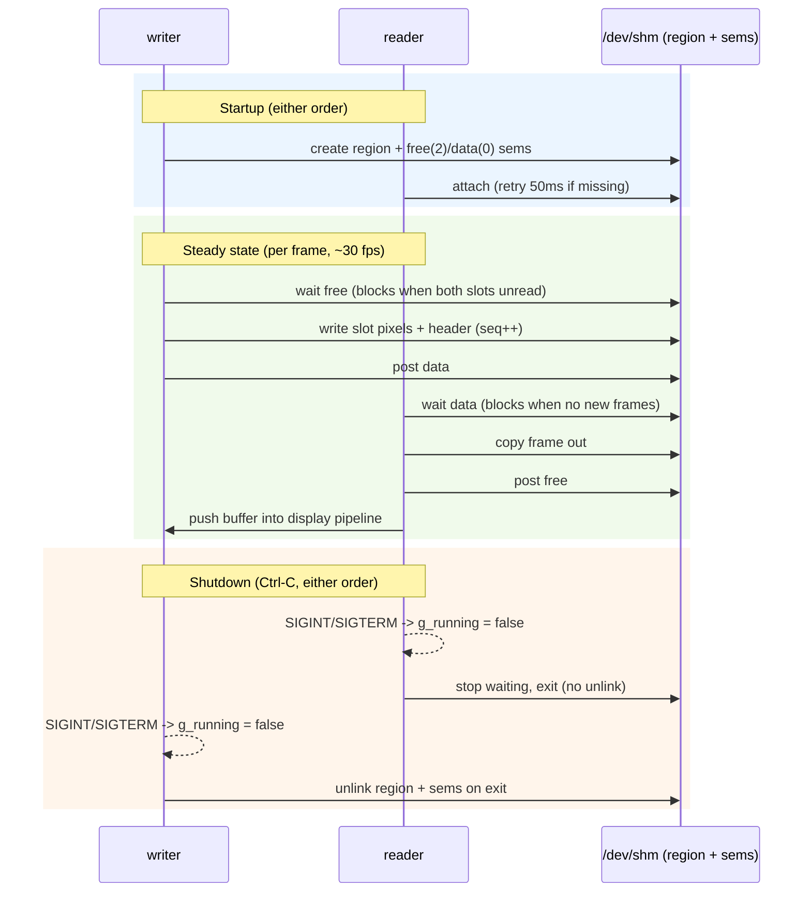

# gst_app_memmap, GStreamer shared-memory frame broker

Shared-memory frame transport between two GStreamer processes. A producer
(`gst_shm_writer`) publishes raw I420 frames into a named POSIX shared memory
region through `appsrc`/`appsink`, and a consumer (`gst_shm_reader`) reads them
back and displays them. The two processes are decoupled by a 2-slot ring buffer
synchronized with a `free`/`data` counting-semaphore pair.

The protocol is described more formally in
`openspec/specs/shm-frame-broker/spec.md`.

## Build

Requires CMake >= 3.16, a C++17 compiler, and GStreamer 1.0 with the app and
video libraries (`gstreamer-1.0`, `gstreamer-app-1.0`, `gstreamer-video-1.0`
pkg-config modules).

```sh
cmake -B build
cmake --build build
```

This produces `build/gst_shm_writer` and `build/gst_shm_reader`.

## Run

Start the writer in one terminal and the reader in another:

```sh
./build/gst_shm_writer &          # terminal 1
./build/gst_shm_reader            # terminal 2
```

Options:

- `gst_shm_reader --sink <element>` selects the display sink (default:
  `autovideosink`).
- `gst_shm_reader --verbose` logs each consumed sequence number and slot.

Press Ctrl-C in either order to stop; see [Shutdown](#shutdown).

## Theory of operation

### Shared region layout

The producer creates, truncates, and `mmap`s a POSIX shared memory object at
`/gst_shm_frame_broker`. The region holds a frame-metadata header followed by
two equal-sized frame slots:

```
+---------------------------+-----------------+-----------------+
| frame_header_t (page-al.) |    slot 0       |    slot 1       |
+---------------------------+-----------------+-----------------+
```

- Header: `frame_header_t` (see `src/shm_frame.hpp`) — magic `GSTB`, version,
  width, height, framerate, fourcc, plane count, per-plane
  offset/stride/size, and the frame sequence number.
- Each slot holds one 1920x1080 I420 frame (a planar, 3-plane format).
- `k_header_size` is the header size aligned up to a page boundary so both
  slots begin page-aligned. `k_frame_size` and `k_region_size` are computed at
  compile time.

### Frame metadata contract

The producer writes the full header into the region before publishing each
frame. The consumer does **not** hardcode caps; it reads the header of the
first available frame and builds its `video/x-raw` source caps from the header's
fourcc, width, height, and framerate (see `shm::make_caps`).

### Free/data semaphore protocol

Two named counting semaphores coordinate access to the ring:

- `/gst_shm_broker_free` — counts free slots; initialized to `k_slot_count` (2).
- `/gst_shm_broker_data` — counts available frames; initialized to 0.

Steady-state handoff:

1. Producer waits on `free` (blocking if both slots are unread), writes pixel
   data + header into its slot, emits a release fence, and posts `data`.
2. Consumer waits on `data` (blocking if no new frames), copies the frame out
   of the slot, posts `free`, and pushes the buffer into its display pipeline.

Because the consumer always posts `free` after copying, the producer can never
overwrite an unread frame, and the consumer can never read a stale slot twice —
the ring stays bounded and every frame is consumed exactly once.

### Ownership and unlink-on-exit

The **writer owns** the shared region and both semaphores. Its
`shared_region_t`/`named_semaphore_t` RAII wrappers `shm_unlink`/`sem_unlink`
the objects when the writer exits, so `/dev/shm` is cleaned up on shutdown. The
reader attaches with `owns = false` and never unlinks.

### Stale-name recovery

If the writer dies uncleanly, stale objects remain in `/dev/shm`. On the next
start, `shm_open(..., O_CREAT | O_EXCL, ...)` fails with `EEXIST`; the writer
`shm_unlink`s / `sem_unlink`s the stale names and retries creation
(`shm::create_region`, `shm::create_semaphore_pair`).

### Attach retry and interruptible waits

- If the reader starts before the writer, it retries attaching to the region
  and semaphores every 50 ms until they exist, or it is interrupted.
- `shm::wait_sem_or_stop` waits with a bounded 100 ms `sem_timedwait` step so
  that Ctrl-C is noticed promptly. On `EINTR`/`ETIMEDOUT` it checks the running
  flag and exits cleanly if a signal arrived; the wait is otherwise retried.

## Sequence diagram


